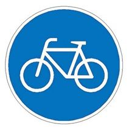
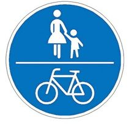
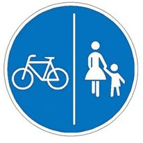
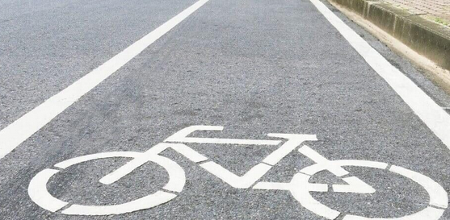
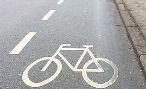
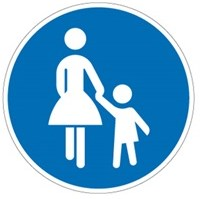
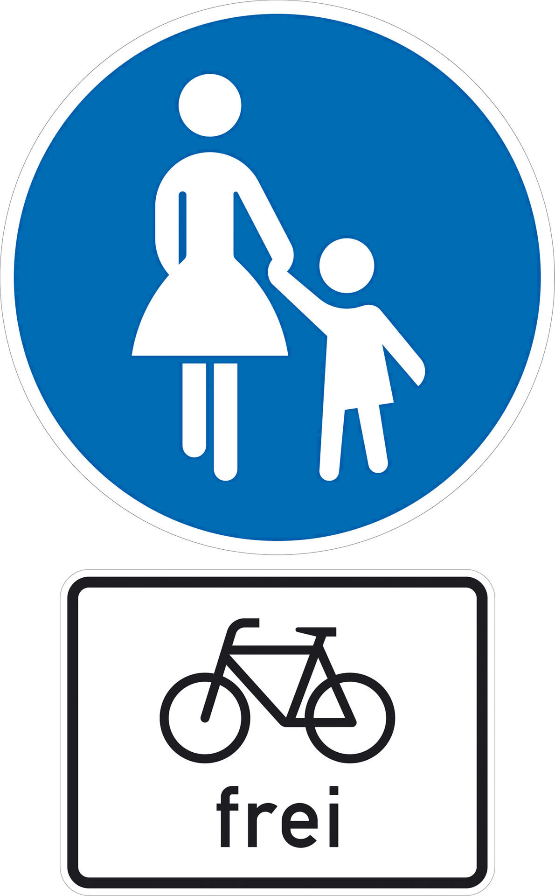
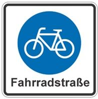

Radwegbeschilderung |NoBicycles|
################################

:date:      2023-05-14
:status:    published
:tags:      Verkehrsregeln

.. |NoBicycles| unicode:: 0x1F6B3 

**Warnung:** 

.. parsed-literal::
    Wir sind keine Rechtsberater. Alle nachfolgenden Informationen beruhen auf unser Wissen und könnten falsch sein.

Radwegetypen
============

Radweg
------

Wird ein Radweg mit diesem Zeichen ausgeschildert ist die Benutzung des Radweges Pflicht.  
Andere Verkehrsteilnehmer dürfen diese Wege nicht benutzen, es sei denn, er ist durch ein besonderes Schild gekennzeichnet. Radfahrer haben jedoch Vorrang. 

Gemeinsamer Geh- und Radweg
---------------------------

Auf gemeinsamen Geh- und Radweg besteht für Radfahrende Benutzungspflicht. Fußgänger 
und Radverkehr nutzen den Verkehrsraum gleichberechtigt. Gegenseitige Rücksichtnahme ist unerlässlich. 

Getrennter Geh- und Radweg
--------------------------

Bei einem getrennten Geh- und Radweg sind die Verkehrsflächen für diese Verkehrsteilnehmer 
optisch unterschiedlich gestaltet. Auch hier besteht eine Benutzungspflicht. Hier muss jeder die 
ihm zugeteilte Seite benutzen.

Radfahrstreifen
---------------

Der Radfahrstreifen ist von der Fahrbahn durch eine breite, durchgezogene Linie von der Fahrbahn abgetrennt und mit Piktogrammen gekennzeichnet. Die Benutzung ist grundsätzlich nur in Fahrtrichtung des Kfz-Verkehrs zulässig. Kraftfahrzeuge dürfen diesen Radfahrstreifen weder befahren noch auf ihm parken. Eine Rot-Markierung ist Verkehrsrechtlich bedeutungslos. 

Schutzstreifen
--------------

Der Schutzstreifen ist Teil der Fahrbahn und durch eine schmale, unterbrochene Linie kenntlich gemacht und mit Piktogrammen versehen. Kraftfahrzeuge dürfen den Schutzstreifen in Ausnahmefällen überfahren, beispielsweise beim Ausweichen. Parken durch Kraftfahrzeuge ist auf den Schutzstreifen nicht zulässig. Eine Rot-Markierung ist Verkehrsrechtlich bedeutungslos.

Gehweg
------

Radfahrende dürfen Gehwege nicht benutzen. Ausnahme sind Kinder bis zu acht Jahren. Diese müssen auf den Gehweg fahren, Kinder bis zehn Jahren dürfen auf dem Gehweg fahren. Eine Aufsichtsperson darf das Rad fahrende Kind unter acht Jahren auf dem Gehweg begleiten.

Gehweg – Radfahrer frei
-----------------------

Ein Weg mit der Ausschilderung „Gehweg – Radfahrer frei“ ist ein Gehweg. Radfahrenden wird ein Benutzungsrecht einräumt, Fußgänger haben jedoch Vorrang. Hier muss man jederzeit halten können, auch wenn unverhofft ein Kind hinter einer Hecke hervor kommt, deshalb ist Schrittgeschwindigkeit angesagt. 

Fahrradstraße
--------------

Die Fahrradstraße ist eine speziell für den Radverkehr vorgesehene Straße. Sie räumt den Radverkehr bewusst Vorteile gegenüber anderen Verkehrsteilnehmern ein. Das Nebeneinanderfahren von Fahrrädern ist erlaubt und Kraftfahrer müssen ggf. ihre Geschwindigkeit reduzieren, wenn sie ansonsten den Radverkehr behindern oder gefährden würden. 

Die Fahrradstraße macht gewissermaßen die Fahrbahn der Straße zum Radweg, der von den übrigen Verkehrsteilnehmern mitbenutzt werden darf. Radfahrende Kinder unter 8 Jahren müssen auch weiterhin den Gehweg benutzen.

